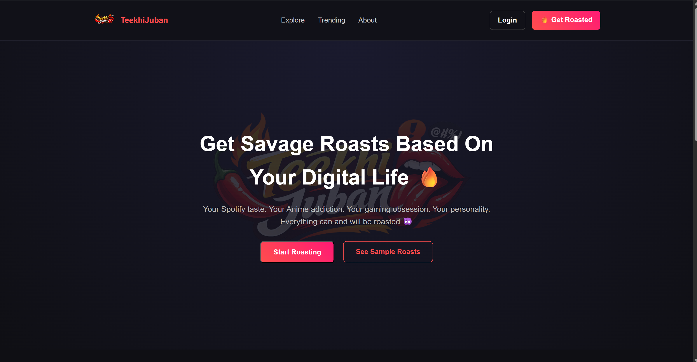
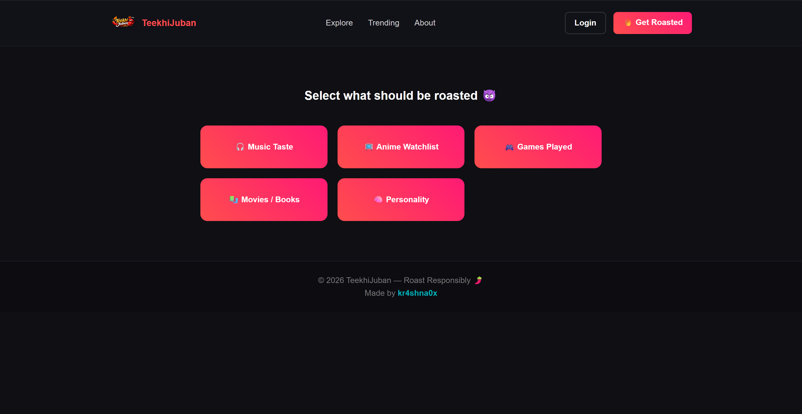
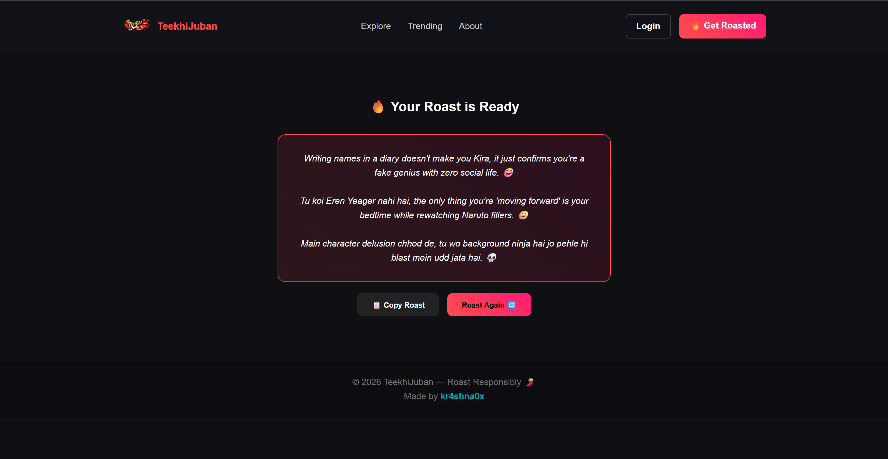
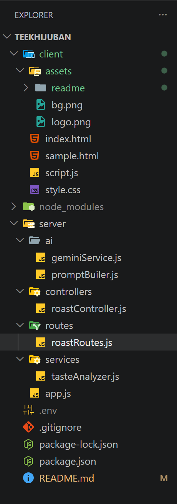

# TeekhiJuban 🌶️🔥

### AI-powered roast generator that turns your digital taste into savage, meme-worthy roasts 😈

Built with a custom tagging engine + prompt engineering + Google Gemini AI to deliver short, sharp, and shareable roasts based on your personality, interests, and habits.

## 🛸 Demo

### 🏠 Home Page

Clean and engaging landing page with a strong call-to-action to start the roasting experience.



---

### 🎯 Parameter Selection

Interactive UI where users choose what part of their digital life they want to get roasted.



---

### 🔥 Roast Result

AI-generated roast displayed in a styled card with copy and share functionality.



## ✨ Features

- 🎯 **Multi-Category Analysis**
  Analyze different aspects of your digital life — music, anime, games, movies, and personality.

- 🧠 **Smart Taste Analyzer**
  Custom rule-based engine that extracts personality traits and behavioral patterns from user input.

- 🤖 **AI-Powered Roasting**
  Generates short, sharp, and meme-worthy roasts using Google Gemini AI.

- 🎭 **Dynamic Roast Styles**
  Choose between different tones:
  - Friendly 😄
  - Savage 💀
  - Villain 😈

- 🌶️ **Adjustable Intensity**
  Control how brutal the roast gets (level 1–5).

- 😂 **Emoji-Enhanced Output**
  AI generates context-aware emojis for more engaging and shareable roasts.

- 📋 **Copy to Clipboard**
  Instantly copy your roast with a single click.

- ⚡ **Dynamic UI Flow**
  Smooth step-based interface (selection → input → loading → result).

- 🎨 **Modern UI Design**
  Clean, responsive, and visually appealing interface with gradient styling.

## 🧠 How It Works

TeekhiJuban follows a structured procedure to transform user input into intelligent, AI-generated roasts:

### 🔄 Flow Overview

User Input → API Request → Controller → Taste Analyzer → Prompt Builder → Gemini AI → Response

---

### ⚙️ Step-by-Step Breakdown

1. **User Input (Frontend)**
   The user selects a category (music, anime, games, etc.) and provides input data along with roast type and intensity.

2. **API Request (Fetch)**
   The frontend sends a POST request to the backend endpoint:
   `/api/roast`

3. **Controller Layer**
   The controller receives the request and orchestrates the processing flow.

4. **Taste Analyzer (Service Layer)**
   A custom rule-based engine analyzes the input and generates personality tags (e.g., `anime_addict`, `fake_genius`).

5. **Prompt Builder (AI Layer)**
   A dynamic prompt is constructed using:
   - User input
   - Generated tags
   - Roast type
   - Intensity level

6. **Gemini AI Integration**
   The prompt is sent to Google Gemini API, which generates a short, witty roast.

7. **Response to Frontend**
   The generated roast is returned and displayed in a styled result card with copy and share options.

---

### 🧩 Key Design Principles

- **Separation of Concerns**
  Routes, controllers, services, and AI logic are modular and independent.

- **Prompt Engineering**
  Carefully structured prompts ensure high-quality, consistent AI output.

- **Scalability**
  The architecture supports future upgrades like database integration, user accounts, and more advanced AI logic.

## 🛠️ Tech Stack

### 🎨 Frontend

- HTML5
- CSS3
- TailwindCss (sample page)
- JavaScript (Vanilla)

---

### ⚙️ Backend

- Node.js
- Express.js

---

### 🤖 AI Integration

- Google Gemini API

---

### 🔗 Utilities & Tools

- Axios (API requests)
- dotenv (environment variables)
- Nodemon (development server)

## 📁 Project Structure

```
TeekhiJuban/
│
├── client/                     # Frontend (UI)
│   ├── assets/                # Images, icons, static files
│   │   └── readme/            # README-specific images (screenshots)
│   ├── index.html             # Main landing page
│   ├── sample.html            # Sample roast page
│   ├── script.js              # Frontend logic (UI flow, API calls)
│   └── style.css              # Styling
│
├── server/                     # Backend (API + AI logic)
│   ├── ai/                    # AI-related logic
│   │   ├── geminiService.js   # Handles Gemini API calls
│   │   └── promptBuilder.js   # Builds dynamic AI prompts
│   │
│   ├── controllers/           # Request handlers
│   │   └── roastController.js
│   │
│   ├── routes/                # API routes
│   │   └── roastRoutes.js
│   │
│   ├── services/              # Business logic
│   │   └── tasteAnalyzer.js   # Generates personality tags
│   │
│   └── app.js                 # Express app entry point
│
├── .env                       # Environment variables
├── .gitignore
├── package.json
└── README.md
```

---

### 📸 Visual Representation



## ⚙️ Installation & Setup

Follow these steps to run the project locally:

### 1️. Clone the Repository

```bash
git clone https://github.com/your-username/teekhijuban.git
cd teekhijuban
```

---

### 2️. Install Dependencies

```bash
npm install
```

---

### 3️. Setup Environment Variables

Create a `.env` file in the root directory and add:

```env
PORT=2027
GEMINI_API_KEY=your_api_key_here
```

---

### 4️. Start the Server

```bash
npm start
```

---

### 5️. Open in Browser

Visit:

```txt
http://localhost:2027
```

---

### ✅ You’re Ready!

Now you can:

- Select a category
- Enter your data
- Generate savage AI roasts 😈🔥

## 🔐 Environment Variables

This project uses environment variables to manage sensitive configuration securely.

Create a `.env` file in the root directory and add the following:

```env id="u9c7zv"
PORT=2027
GEMINI_API_KEY=your_gemini_api_key
```

---

### 📌 Description

- `PORT`
  The port on which the server will run locally.

- `GEMINI_API_KEY`
  Your Google Gemini API key used for generating AI-based roasts.

---

### ⚠️ Important Notes

- Never commit your `.env` file to version control.
- Keep your API keys secure and private.
- Make sure `.env` is included in your `.gitignore`.

## Future Improvements -

- 🎨 **Frontend Upgrade (Tailwind Css)**
  Convert the current UI into a modern TailwindCss-based application for better scalability and component-based architecture.

- 🧠 **Advanced Taste Analysis**
  Improve the tagging system using more complex rules or machine learning for deeper personality insights.

- 📸 **Roast as Shareable Image**
  Generate meme-style roast cards (images) that users can download or share on social media.

- 🌐 **Live Deployment**
  Deploy the application online (e.g., Vercel, Render) for public access.

- 🔐 **User Authentication**
  Add login/signup functionality to save user history and preferences.

- 📊 **Roast History & Analytics**
  Store previous roasts and show user behavior insights over time.

- 🎭 **More Roast Styles**
  Add new modes like:
  - Gen-Z slang roast
  - Dark humor roast
  - Desi/Hinglish roast

- ⚡ **Performance Optimization**
  Improve API response handling and loading experience.

- 🧩 **Modular AI Integrations**
  Support multiple AI models (OpenAI, Gemini, etc.) for flexibility.

## 👤 Author

**Krishna Singh Chauhan**

- 🦚 GitHub: https://github.com/Krishna5601-Cpu
- Passionate about Web Development, AI, and Security Researching.

---

> If you like this project, feel free to ⭐ the repository and share it!
